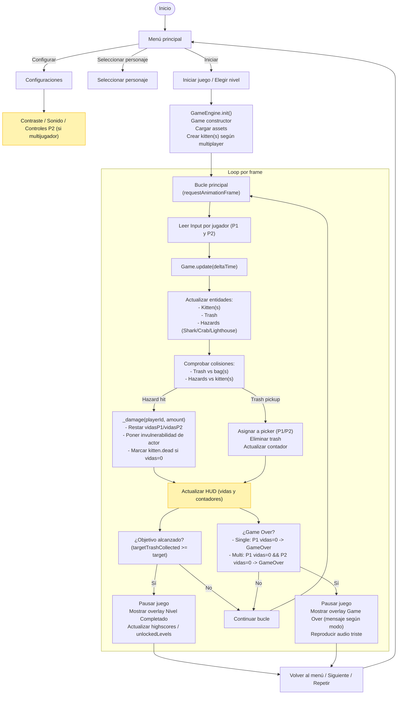

# Diagrama de flujo: Beach Kitten Cleanup

Este archivo contiene un diagrama de flujo (Mermaid) que describe el flujo principal del juego: desde el menú hasta las condiciones de Game Over y nivel completado. Puedes visualizar este diagrama en GitHub (si tu visualizador soporta Mermaid) o en https://mermaid.live

---

## Explicación rápida de nodos clave
- Input: `InputHandler` recoge teclas para P1 y P2. P2 usa `IJKL` por defecto o `Arrows` si así se configura.
- Pickup: cada `Trash` al colisionar con la bolsa se marca como recogida por el jugador correspondiente; el total es la suma de las bolsas.
- Damage: `_damage(playerId, amount)` decrementa `livesP1` o `livesP2`. Se marca `kitten.dead = true` cuando sus vidas llegan a 0.
- Game Over: en multijugador solo ocurre cuando ambos jugadores están sin vidas; en single-player si P1 llega a 0.

## Cómo ver el diagrama
- En GitHub: el archivo `.md` con Mermaid debería renderizarse si tu repositorio/preview soporta Mermaid.
- En el navegador: copia el bloque `mermaid` y pégalo en https://mermaid.live para ver/editar el diagrama.

---

Si quieres que genere además:
- Un PNG/SVG exportado del diagrama y lo añada a `docs/` (necesitaría una herramienta externa o que tú lo confirmes),
- Más detalle en sub-diagramas (por ejemplo, un sub-diagrama para `Kitten.update()` o para el sistema de `Trash`), o
- Una versión en PlantUML/PNG para insertar en presentaciones,
dímelo y lo preparo.